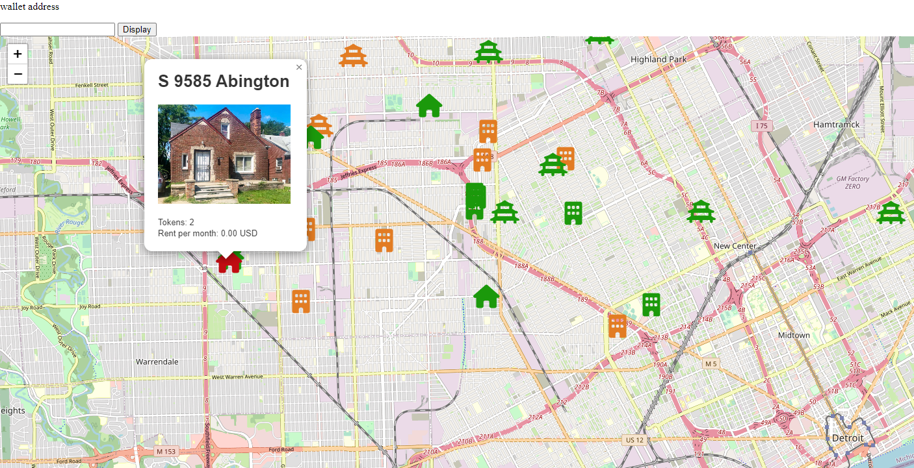

# Explorateurs

Vous pouvez vous servir des explorateurs de chain, pour en savoir plus sur : &#x20;

* ce qu'il se passe sur vos wallet (transactions, liste de tokens,..),
* retrouver des adresses de smart-contrat (exemple ci-dessous pour l'USDC avec gnosisscan),

<figure><figcaption></figcaption></figure>

Explorateurs :&#x20;

* sur Gnosis : [GnosisScan](https://gnosisscan.io/), [Blockscout](https://blockscout.com/xdai/mainnet),
* sur Ethereum : [EthherScan](https://etherscan.io/),  [Blockscout](https://blockscout.com/eth/mainnet).

## Transaction hash

Si vous rencontrez un soucis sur une transaction, vous aurez besoin pour vous faire aider de donner le "Transaction Hash" de la transaction.\
Cet identifiant unique, se trouve :

*   en allant sur l'explorateur (de la chaine sur laquelle vous avez  le soucis) en indiquant dans la partie recherche votre adresse publique :

    <figure><figcaption></figcaption></figure>
*   soit, en cliquant sur les trois petit point de votre MetaMask

    <figure><figcaption></figcaption></figure>
*   vous voyez alors les Transaction hash des transactions que vous avez faites avec votre wallet

    <figure><figcaption></figcaption></figure>

en allant sur l'explorateur (de la chaine sur laquelle vous avez  le soucis) en&#x20;
